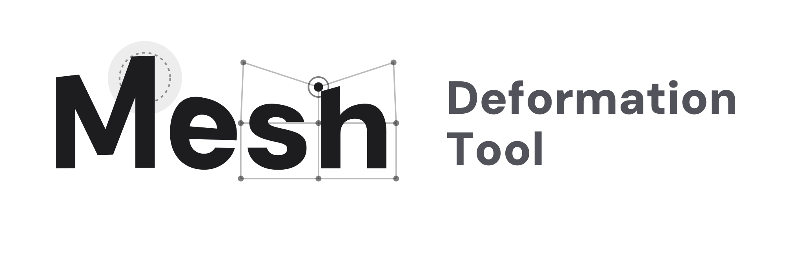

  <picture>
    <source media="(prefers-color-scheme: dark)" srcset="Blobs~/logo-white.png">
    
  </picture>

# Lattice Deformation Tool

A Unity 2022.3+ editor extension for adjusting `MeshRenderer` and `SkinnedMeshRenderer` geometry as layers, with non-destructive NDMF Preview and build-time baking. It brings lattice, brush, vertex selection, masking, and BlendShape I/O into one workflow.

Use it for fitting clothing, hair, and accessories, manually correcting intersections, or turning a shape adjustment into a BlendShape. The original Mesh asset is never modified.

日本語ドキュメント: [README.md](README.md)

## Main features

- **Lattice**: Move control points to deform broad areas smoothly
- **Brush**: Make local edits with Normal, Move, Smooth, and Mask modes
  - Smooth, Linear, Constant, Sphere, and Gaussian falloff
  - Surface-distance falloff, X/Y/Z mirroring, and penetration visualization
- **Vertex Selection**: Select vertices directly and apply Move, Rotate, or Scale
  - Box selection and proportional editing are supported
- **Groups and Layers**: Stack Lattice and Brush layers with independent names, enabled states, and weights
  - Duplicate, copy and paste, or reorder layers and groups; split and flip individual layers
- **Vertex Mask**: Paint protected vertices to limit Brush edits and layer contributions
- **BlendShapes**: Import an existing BlendShape as a Brush layer and output a group or layer as a new BlendShape
- **Mesh rebuild**: Optionally recalculate normals, tangents, bounds, and SkinnedMesh bone weights
- **NDMF Preview / Bake**: Inspect changes on a proxy Mesh and apply them only during an avatar or world build

## Supported targets and requirements

- Unity 2022.3 LTS or later
- `MeshFilter` + `MeshRenderer`, or `SkinnedMeshRenderer`
- NDMF (`nadena.dev.ndmf`) 1.9.0 or later
- VRChat Creator Companion (recommended when installing through VPM)

## Installation

1. Add the [VPM repository](https://vpm.32ba.net) to VCC and install **Lattice Deformation Tool** in your project.
2. Add `LatticeDeformer` to the same GameObject as the Renderer you want to adjust.
3. Check **Skinned Mesh Source** or **Static Mesh Source** in the Inspector. A compatible Renderer on the same GameObject is assigned automatically.
4. Enable **(NDMF) Enable Mesh Preview** to inspect changes in the Scene view.

To use a source checkout directly, place the repository under the VCC project's `Packages` directory.

## Basic workflow

1. Create or select a Group in the `LatticeDeformer` Inspector.
2. Add a Lattice Layer or Brush Layer to the Group.
3. Select the Layer and press **Open Lattice Editor** or **Open Brush Editor** at the bottom of the Inspector.
4. Choose the editing mode and options from the **Mesh Deformer** overlay in the Scene view.
5. Adjust Group and Layer enabled states and weights, then inspect the combined result with NDMF Preview.
6. Run the normal NDMF-enabled avatar or world build to bake the deformation into the generated Mesh.

### Scene view controls

- Lattice: Click a control point, Shift-click to extend the selection, and move it with the handle
- Brush: Alt+scroll changes radius; Shift+scroll changes strength
- Vertex Selection: Click, Shift-click, Ctrl-click, or drag a rectangle to select vertices
- Vertex Transform: W / E / R switches Move / Rotate / Scale
- Proportional Editing: Alt+scroll changes the influence radius
- Undo / Redo: Standard Unity Undo and Redo are supported

## Common workflows

### 1. Adjust a clothing silhouette with a Lattice

1. Add a Lattice Layer and fit its grid divisions and bounds to the target area.
2. Open the Lattice Editor, select one or more control points, and move them.
3. Tune the Layer Weight and keep fine corrections in separate Layers when useful.

### 2. Correct local intersections with Brush and Mask

1. Add a Brush Layer and choose Normal or Move in the Brush Editor.
2. Protect areas that should remain fixed with Mask mode.
3. If needed, enable **Show Penetration**, assign a reference Renderer, and correct the vertices highlighted in red.
4. Switch the overlay to Vertex Selection for vertex-level finishing.

Penetration visualization is an editing aid based on an approximate test. It is not an exact posed-surface test of a baked reference `SkinnedMeshRenderer`.

### 3. Edit and output a shape adjustment as a BlendShape

1. Use **Import BlendShape** to load an existing Source Mesh BlendShape as a Brush Layer.
2. Edit the shape with Brush or Vertex Selection.
3. Enable **BlendShape Output** on the Layer or Group, then set its output name and curve.
4. Check the weight in Test Mode and NDMF Preview before building.

Groups that deform vertices directly and Groups that output BlendShapes can coexist on the same component.

## Data behavior

- Vertex changes are never written back to the Source Mesh asset.
- Deformation data is stored in the scene or Prefab as Groups and Layers on `LatticeDeformer`.
- NDMF Preview uses a display proxy and restores the upstream Mesh display when preview ends.
- A legacy `BrushDeformer` can be copied into a Brush Layer with the explicit Inspector migration action. The legacy component is retained as a disabled backup.

## License

This package is provided under the MIT License. See [LICENSE](LICENSE) for details.
